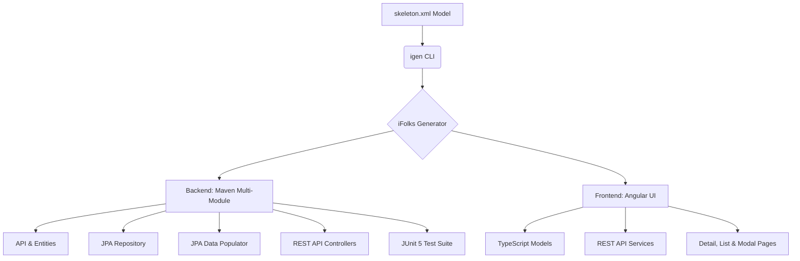

# iFolks Generator 🚀

[]()
[]()
[]()
[]()

**iFolks Generator** is a premium, open-source, high-productivity scaffolding tool based on model-driven code generation. It enables developers to bootstrap and generate complete, ready-to-run full-stack applications (Spring Boot 4 + Spring Data JPA + Angular) from a simple XML metadata model (`skeleton.xml`) in a matter of seconds.

---

## 🌟 Key Features

* **Model-Driven Development (MDD):** Define your domain model, selection behaviors, audits, and validations in a single `skeleton.xml` file, and let the generator build the rest.
* **12-Tier Standardized Architecture:** Generates clean, decoupled, and industry-standard maven sub-modules for:
  * **API & Model:** Clean interfaces and entities (fully leveraging modern **Java Records** for lightweight DTOs like `SelectItem`).
  * **JPA Persistence & Services:** Decoupled data access layer with Spring Data JPA and standard transaction-managed services.
  * **REST Web Services:** Fully configured Spring MVC Controllers with robust error handlers and Jackson `JsonMapper` serialization.
  * **Angular Frontend:** Generates complete TypeScript models, REST clients, search filters, lists, details components, and modals automatically!
* **Automated JUnit 5 Test Harness:** Generates fully configured, warning-free integration testing environments using **JUnit 5 Jupiter** and `@SpringJUnitConfig`.
* **Zero Boilerplate Database Seeding:** Generates automatic JPA-based database populators that read CSV files and seed your local database instantly for quick prototyping.

---

## 📦 Project Architecture Overview



---

## 🛠️ Getting Started

### Prerequisites
* **Java 21** or higher.
* **Maven 3.9** or higher.

### 1. Bootstrapping a Project (`igen init`)
Install the `igen` CLI binary and initialize a new project workspace:
```bash
# Initialize a new project structure
igen init --project MyAwesomeProject --domain org.mycompany
```
This generates a starter workspace containing your `data-model/skeleton.xml` and initial configuration files.

### 2. Defining your Domains & Entities
Edit your `skeleton.xml` to declare your database tables, primary keys, relationships, and selection behaviors.

### 3. Generating Code (`igen generate`)
Run the generator within your project folder to build the complete full-stack application:
```bash
# Run code generation
igen generate
```
The generator will instantly write all Maven modules, Java packages, Spring configurations, TypeScript files, and Angular components based on your metadata.

### 4. Running the Tests
Compile and run the generated test harness to verify your environment is ready to use:
```bash
cd myawesomeproject-tests
mvn clean install
```

---

## 📂 Repository Structure

The generator is organized into modular components:

| Module | Description |
| :--- | :--- |
| **`generator-model`** | Core definitions of the metadata representation, Java class naming, and XML schemas (`skeleton-metadata-1.0.xsd`). |
| **`generator-components`** | Business rules factories, selection column uniqueness checks, and JAXB parsing services. |
| **`generator-skeletons`** | Core file-writing command executor and template engine hooks. |
| **`generator-core-skeletons`** | Velocity templates and writers for Spring configuration, database schemas, entities, and JUnit 5 components. |
| **`generator-rest-skeletons`** | Velocity templates for Spring Boot REST starters, configuration, and controller endpoints. |
| **`generator-angular-skeletons`** | Velocity templates for typescript UI models, rest clients, list/details layouts, and routing. |
| **`generator-services`** | Higher-level services coordinating metadata loading, validation, and generation. |
| **`generator-bash`** | The Command Line Interface (CLI) executing package (compiles to the `igen` ZIP binary). |
| **`generator-tests`** | Full integration test suites asserting complete compilation and test passes on simulated metadata. |

---

## 📝 License

Distributed under the Apache Software License, Version 2.0. See `LICENCE.md` for more details.
